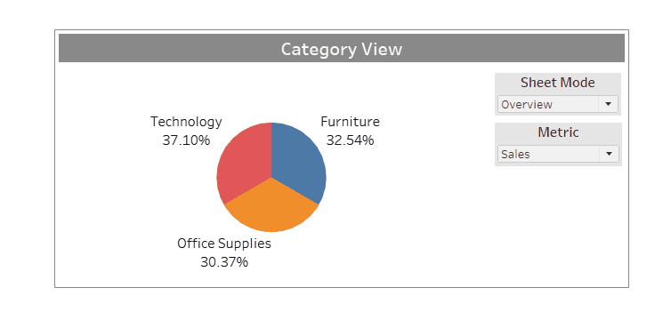

# Tableau-JavaScript
https://tableau.github.io/extensions-api/docs/trex_getstarted.html

## Introduction
The idea here is to leverage the power of Tableau Extensions to create highly flexible and dynamic dashboards.

## Problem
- Create a dashboard `Category View` dashboard, based on Sample-Superstore dataset.
- The user should be able to switch between `Overview` & `Comparison` sheet mode.
- `Overview Mode`: This mode would provide the metric distribution of each category.
- `Comparison Mode`: This mode would allow the user to compare individual categories based on different metrics.
- Catch here is that each mode has different set of filters, and the task is to hide them based on the mode selected.

## Demo
Note: How the set of filters change when `Sheet Mode` is toggled.

